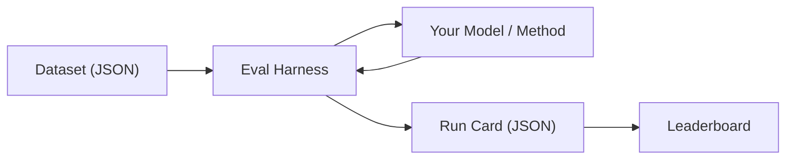

# MT Evaluation

The **MT Eval Harness** is a language-pair-agnostic recording surface for machine translation experiments. It doesn't judge *how* you translate — it measures what comes out.

Run any translation approach against a standardized dataset. The harness produces a **run card** — a self-contained JSON document recording every input, output, metric, and environment detail. Run cards are the unit of comparison: deterministic, reproducible, and auditable.

## How It Works

1. **Pick a dataset** — A curated set of source→target pairs with gold-standard references
2. **Run the harness** — It sends each entry through your model, collects outputs, and scores them
3. **Get a run card** — chrF++, exact match rate, FST acceptance, latency, cost — all in one JSON file
4. **Submit to the leaderboard** — Compare your method against others on the same dataset

## Links

- **[Leaderboard](/leaderboard)** — Live rankings across datasets and language pairs
- **[Eval Harness on GitHub](https://github.com/gamedaysuits/gds-mt-eval-harness)** — Source code, installation, and contribution guide
- **[Harness Documentation](/docs/eval/harness)** — Installation, CLI flags, and run card schema
- **[Evaluation Datasets](/docs/eval/datasets)** — Available datasets and the dataset format specification
- **[Run Card Specification](/docs/eval/run-card)** — Full v2.0 schema reference

:::danger DO NOT TRAIN on evaluation data

These datasets exist to **measure** translation quality, not to improve it. Methods trained, fine-tuned, or few-shot-prompted with evaluation data will produce artificially inflated scores and will be **disqualified from the leaderboard**.

If you need training data, use separate corpora. The evaluation sets must remain unseen by your model.
:::

## What Gets Measured

The harness computes several complementary metrics per run:

| Metric | What it tells you |
|--------|-------------------|
| **chrF++** | Character-level n-gram overlap with the gold standard. Language-agnostic, no tokenizer needed. |
| **Exact match rate** | Percentage of outputs identical to the gold standard. A high bar — useful for morphologically precise targets. |
| **FST acceptance rate** | Percentage of outputs accepted by a finite-state transducer analyzer (when available). Measures morphological validity. |
| **Latency** (avg / median / p95) | How fast your method responds. |
| **Cost** (total / per-entry) | Token usage and USD cost for API-based methods. |

## Next Steps

- **[Install the harness](/docs/eval/harness#installation)** — Python 3.10+, two pip packages
- **[Run your first experiment](/docs/eval/harness#usage)** — One command, one dataset, one run card
- **[Browse datasets](/docs/eval/datasets)** — See what's available for benchmarking
